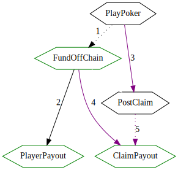

# BET Protocol for custom contracts using Crypto-Conditions

To facilitate participation in off-chain smart contracts on the [Komodo Platform](https://komodoplatform.com/en), providing a mechanism for dispute resolution.

* [Introduction](#introduction)
   * [Properties](#properties)
* [Contract Security](#contract-security)
* [Transactions](#transactions)
   * [Session](#session)
   * [Fund](#fund)
   * [PlayerPayout](#playerpayout)
   * [PostClaim](#postclaim)
   * [ResolveClaim](#resolveclaim)
   * [ClaimPayout](#claimpayout)
* [Chain functions](#chain-functions)
   * [LockTime](#locktime)
   * [VerifyPoker](#verifypoker)
   * [ImportPayout](#importpayout)
* [Notary proof format using MOM](#notary-proof-format-using-mom)
* [Missing API methods](#missing-api-methods)
* [Testing](#testing)

## Introduction

There are two blockchains, a blockchain providing a value token (**KMD**) and a blockchain providing an evaluation function (**PANGEA**). KMD and PANGEA may be used to refer to the ledger or the currency unit on the ledger, as is the case with Bitcoin.

There are two or more **Players**, who own some KMD.

There is a **Dealer**, who owns some PANGEA.

Each participant is identified by a public key and has a private key.

This document illustrates by way of an executable Haskell script. See also [Bet.hs](./Bet.hs) for supporting code.

```haskell
import           Network.Komodo.Specs.Bet
import qualified Network.Haskoin.Internals as H

dealer  = "025af7eed280ca8d1ebb294e9388378a2abf5455072c17bdf22506b6aa18dc8a24"
player1 = "03c8a965089173d746144cd667c8cedf985460ecc155811bd729e461f0079222f7"
player2 = "03d6de78061ca1695ba068d15ecf4a5431de9dccce7b45a73bb996e7e596acdba7"

privKeys = [ "UrsT8pXPH1WvfTkkRzP2JsLTB6ebqhH3n6p31UcXpgyoESB9wvPp" -- dealer
           , "Up3VgThhFXFXG7QN5ykym2hkiBrfB76GNhehyUXNG7AJMdLoVPU7" -- player1
           , "UpyycopsYkknBsPd5Y2BLzKrTYVnhKoFL59H49JWn6TqXmJKxER4" -- player2
           ]
```

### Properties

These are the properties that we want the solution to provide.

* Players only need to hold a single value token i.e. units of KMD.
* Only the Dealer needs to hold PANGEA. They may obtain this token via [atomic swap exchange](https://komodoplatform.com/en/barterdex).
* No new domain specific evaluation functions in value chain KMD (but we may introduce general purpose functions).
* Minimal data overhead in value chain KMD.
* On-chain dispute resolution protocol for impartial evaluation of states.

## Contract Security

In an ideal world, in order to facilitate off chain smart contracts we could simply have the players fund an escrow transaction, do their off-chain processing, and submit an escrow release with an updated payout vector.

However, in reality, for certain kinds of problems, we require a dispute resolution protocol. This is because players may timeout, or a player may refuse to sign a payout transaction if they lose a bet.

In practice, there isn't alot of distinction between a timeout and a dispute; a player that refuses to sign a payout and a player that has timed out are indistinguishable from a cryptographic perspective. In either case, if an n/2+1 majority remains, they get to decide what happens.

If, after a single player has timed out, there does not remain an n/2+1 majority, then we have to fall back to the dispute resolution protocol.

The below table illustrates:

| # players | # sigs for payout | # timeouts for dispute |
|-----------|-------------------|------------------------|
| 2         | 2                 | 1                      |
| 3         | 2                 | 2                      |
| 4         | 3                 | 2                      |


## Transactions



1. Fund contains Session txid.
2. If all goes well, players all agree on a payout.
3. Otherwise, players will post gamestates.
4. After a time interval, any player may submit a valid claim resolution.
5. Claim resolution will verify submitted claims.
6. Any player may submit a valid claim payout.
7. Claim payout will verify a notary proof of resolution.

If you havn't already, this might be a good time to refer to the [transaction basics](./basics.md) document.

### Session

JSON: [txSession.json](./vectors/txSession.json)

The **Session** transaction is made on the PANGEA chain, and contains the ID of the **Fund** transaction as a data output. The dealer is expected to hold the PANGEA units neccesary to make this transaction. The dealer also provides outputs that are sufficient for the players to post gamestates in the event of a dispute. An exec output is provided that will trigger an on-chain evaluation a subsequent payout; it includes a delay of a number of blocks before it can be triggered.

Note: Currently, this transaction may or may not be used; in the case that it is not used, it would be good to provide the dealer with a way to recollect the outputs, even though they maybe just amount to dust.

```haskell
dataFee = 4
evalFee = 10
delayBlocks = "some number of blocks"

-- lock time a certain number of blocks so players can post evidence,
-- and require a sig from any participant to initiate VerifyPoker
evalClaimCond = Threshold 3 [ Eval "LockTime" delayBlocks
                            , Eval "VerifyPoker" ""
                            , Threshold 1 [ ecCond dealer
                                          , ecCond player1
                                          , ecCond player2 ] ]
startGameTx =
  KTx
    -- Dealer provides units of PANGEA
    [ TxInput (OutPoint "c44de6fc17844c0151c2cfb146435e466290f5aacefb5b3ac1f437a0c7b046d9" 0)
              (addressScript dealer)
    ]
    -- Output for each player to post game state binary
    [ TxOutput evalFee $ CCOutput evalClaimCond
    , addressOutput dataFee dealer
    , addressOutput dataFee player1
    , addressOutput dataFee player2
    ]


startGameTxEncoded = signEncode privKeys startGameTx
startGameTxid = txHash startGameTxEncoded
```


### Fund

JSON: [txFund.json](./vectors/txFund.json)

The **Fund** transaction is made on the KMD chain, and uses inputs from each player, and creates a single CryptoCondition output. The output may either be spent by a quorum of the participants (n/2+1 players + dealer), or by a subset of notaries.

```haskell
-- payout is either ImportPayout or quorum


data Fund = Fund
  { playerInputs :: [TxInput]
  }
quorumCond = Threshold 2 [ ecCond dealer
                         , Threshold 2 [ ecCond player1, ecCond player2 ] ]
payoutCond = Threshold 1 [ quorumCond
                         , Eval "ImportPayout" (encode startGameTxid) ]

fundTx =
  let inputs =
        -- players fund game
        [ TxInput (OutPoint "ec851f0d887638016f5d6818a1ace0038abccdb502d2b0d661c97d853d089a65" 0) 
                  (addressScript player1)
        , TxInput (OutPoint "b66de6fc17844c0151c2cfb146435e466290f5aacefb5b3ac1f437a0c7b046d9" 0)
                  (addressScript player2)
        ]
      fundAmount = 1000
      outputs = [ TxOutput fundAmount $ CCOutput payoutCond ]
   in KTx inputs outputs

fundTxid = txHash $ signEncode privKeys fundTx
```

### PlayerPayout

JSON: [txPlayerPayout.json](./vectors/txPlayerPayout.json)

The **PlayerPayout** transaction is made on the KMD chain. It is independent of the **Session** transaction. It distributes the fund according to a payout vector that is agreed upon by a majority of the players + the dealer.

```haskell
payouts = [addressOutput 50 dealer, addressOutput 950 player1]
playerPayoutTx = KTx
  -- Spending the fund
  [ TxInput (OutPoint fundTxid 0) $ ConditionInput payoutCond ]
  -- Payout each participant
  payouts
```

### PostClaim

JSON: [txPostClaim.json](./vectors/txPostClaim.json)

The **PostClaim** transaction is made on the PANGEA chain. It registers a game state for evaluation, in the case that **PlayerPayout** is not possible for some reason. Each player has the opportunity to perform a **PostClaim** by spending an output of the **Session** transaction.

```haskell
makeClaimDataTx pk idx bin = KTx
  -- Output index depends on who is making the claim
  [ TxInput (OutPoint startGameTxid idx) (addressScript pk) ]
  -- There is no output amount, the whole input is fees
  [ TxOutput 0 $ CarrierOutput bin ]

claimDataTxs = [ makeClaimDataTx dealer 0 "win"
               , makeClaimDataTx player1 1 "cheat"
               , makeClaimDataTx player2 2 "invalid"
               ]
```

### ResolveClaim

JSON: [txResolveClaim.json](./vectors/txResolveClaim.json)

The **ResolveClaim** transaction posts a resolution of the claim. The resulution will be evaluated and the transaction will only be accepted if the claim is correct.

```haskell
resolveClaimTx =
  let payoutsBin = encodePayouts payouts
   in KTx
      [ TxInput (OutPoint startGameTxid 0) (ConditionInput evalClaimCond) ]
      [ TxOutput 0 (CarrierOutput payoutsBin) ]

txResolveClaimEncoded = signEncode privKeys resolveClaimTx
```

### ClaimPayout

JSON: [txClaimPayout.json](./vectors/txClaimPayout.json)

The **ClaimPayout** transaction executes a payout vector with reference to a **ResolveClaim** transaction. Only one signature is required to execute it, but it requires the complete payload of the **ResolveClaim** transaction, plus notary proof of that transaction. Additionally, the **ResolveClaim** transaction must have the correct format:

1. The first output must contain the **ResolveClaim** raw transaction.
1. The second output must contain cryptographic proof of notarisation in the PANGEA chain of that transaction.
1. The last outputs must be a byte for byte copy of the OP\_RETURN data in **ResolveClaim**.

```haskell

(importProof, mom) = getExampleImportProof $ txHash txResolveClaimEncoded

payoutClaimTx =
  let txOutResolveClaim = TxOutput 0 $ CarrierOutput $ encode txResolveClaimEncoded
      txOutNotaryProof = TxOutput 0 $ CarrierOutput $ encode importProof
   in KTx
      [ TxInput (OutPoint fundTxid 0) (ConditionInput payoutCond) ]
      ([ txOutResolveClaim , txOutNotaryProof ] ++ payouts)
```

## Chain functions

Chain functions are on-chain tests encoded as CryptoConditions `Eval` nodes.

They work by providing a `method`, and a `parameters` payload, which are hashed together as a preimage (or scriptHash) In order to fulfill the condition, the preimage needs to be provided, and `method` is called with the preimage and the transaction as parameters. If the method does not return an error, the condition has passed. Below are the methods required for the Bet protocol:

### LockTime

LockTime is a Crypto-Conditions eval method that specifies an interval in blocks before the condition may be fulfilled, relative to the block height of the condition.

Parameters:

* `nBlocks`: Number of blocks encoded as a VarInt, via preimage.

Verifications:

* That the block height of the transaction that contains the LockTime condiiton, plus `nBlocks`, is less than the current block height being mined.

### VerifyPoker

VerifyPoker is a Crypto-Conditions eval method that evaluates a data output against a set of application states. It is fulfilled by **ResolveClaim**.

Parameters:

* Poker GameHeader, including: game ID, public keys of participants.
* Winning output binary, via OP\_RETURN at output 0.
* List of posted game states, inside OP\_RETURN 0 of spending transactions for each of the parent transaction (**Session**) outputs starting at output 1.

Verifications:

1. Valid states are ones that conform to the provided GameHeader 
1. For each of the posted game states, that the longest valid state produces the exact same binary attached in OP\_RETURN output 0. This is equivalent to the "longest chain wins" rule.

```haskell

verifyPoker :: KTx -> PokerHeader -> IO ()
verifyPoker (KTx [TxInput (OutPoint sessionId 0) _] outputs) ph = do
  -- traverse to Session via Input, then get spent of Session from position 1
  sessionSpends <- catMaybes . drop 1 <$> getTxSpends sessionId
  let gamestates = [bs | KTx _ [TxOutput _ (CarrierOutput bs)] <- sessionSpends]
  assert "posted gamestates" $ gamestates /= []
  let results = catMaybes $ pokerVM ph <$> gamestates
  assert "have valid results" $ results /= []
  let (_, goodPayouts) = head $ reverse $ sort results

  let givenPayouts = case outputs of
        [TxOutput _ (CarrierOutput gp)] -> gp
        _ -> error "output incorrect"
  assert "given payouts correct" $ givenPayouts == goodPayouts

  where
    getTxSpends _ = pure $ Nothing : (Just <$> claimDataTxs)


pokerVM :: PokerHeader -> PokerBody -> Maybe PokerResult
pokerVM _ "cheat"   = Just (10, encodePayouts cheatPayouts)
pokerVM _ "win"     = Just (20, encodePayouts payouts)
pokerVM _ "invalid" = Nothing


cheatPayouts = [addressOutput 10 dealer, addressOutput 400 player1, addressOutput 590 player2]


data PokerHeader = PokerHeader
  H.PubKey    -- Dealer pubkey
  [H.PubKey]  -- Player pubkeys
  H.VarInt    -- Fractional dealer commission (1/n)
  H.Hash256   -- Entropy


instance Serialize PokerHeader where
  put (PokerHeader dpk pks gid bs) = put dpk >> putVarList pks >> put gid >> put bs
  get = PokerHeader <$> get <*> getVarList <*> get <*> get

type PokerBody = ByteString
type PokerResult = (Int, ByteString)  -- Length of game, binary payouts

```


### ImportPayout

ImportPayout is a Crypto-Conditons eval method that is used to execute a payout vector from another chain. It is fulfilled by the **ClaimPayout** transaction on KMD chain.

Parameters:

* ID of **Session** transaction on PANGEA, via preimage.
* Complete body of **ResolveClaim** transaction on PANGEA, via OP\_RETURN at output 0.
* **TxImportProof** notary proof, via OP\_RETURN at output 1.

Verifications:

1. That the output 0 of the Session transaction has been spent, by the attached ResolveClaim. This indicates that the attached payout vectors were verified by the app-chain eval function (VerifyPoker).
1. That the notarisation ID included in the TxImportProof points to a transaction signed by notaries.
1. That the TxImportProof is valid given the txid of the ResolveClaim transaction and the MOM from the notarisation.
1. That the OP\_RETURN output of the attached ResolveClaim transaction is exactly equal to the outputs in ClaimPayout, not including the attachments (drop the attachments from the list of outputs of ClaimPayout).

```haskell
verifyImportPayout :: KTx -> TxHash -> IO ()
verifyImportPayout (KTx _ outputs) sessionId = do
  let ((TxOutput _ (CarrierOutput bodyResolveClaim)) :
       (TxOutput _ (CarrierOutput bodyImportProof)) :
       payouts) = outputs

      (givenSessionId, givenPayouts) =
        case decodeTxBin bodyResolveClaim of
          Right (KTx [TxInput (OutPoint gid 0) _] [TxOutput _ (CarrierOutput gp)]) -> (gid, gp)
          e -> error $ show e

      Right (TxImportProof notarTxid branch) = decode bodyImportProof
      mom = getNotaryMom notarTxid

  assert "session id correct" $ sessionId == givenSessionId
  assert "merkle proof valid" $ execMerkleBranch branch (H.doubleHash256 bodyResolveClaim) == mom
  assert "payouts match" $ encodePayouts payouts == givenPayouts
  assert "notary tx legit" True  -- can't verify here

    where
      decodeTxBin bin =
        let Right tx = decode bin
         in runExcept $ decodeTx tx

      -- Missing API method
      getNotaryMom notarTxid =
        if notarTxid == notarisationTxid then mom
                                         else error "wrong notarisationTxid given"
```

## Notary proof format using MOM

The notary proof is neccesary since we are importing a paying vector from another chain. So the notaries are used as an oracle to say that the referenced transaction was accepted by the app-chain.

App chains of this type will intermittently post notarisations to the value chain (KMD). These notarisations indicate that the block being notarised has some degree of finality, which we are going to accept. The [SPV](https://bitcoin.org/en/glossary/simplified-payment-verification) protocol can be used to verify that a transaction exists in a block. However, not every block is notarised, because app chains may have short block times, so they may only notarise every 100 blocks or so. In this case, in order to support payment verification across chains, the notarisation on KMD will include a **MOM** ("Merkle of Merkles").

The MOM is simply a binary [Merkle Tree](https://en.wikipedia.org/wiki/Merkle_tree) where the leaf nodes are all the transaction merkle roots since the last notarisation, and up to and including the block currently being notarised.

Each block contains a transaction merkle root, so if you have the merkle branch and the index of the transaction in he block you can verify that it's there. In this case we concatenate the SPV merkle branch and the MOM merkle branch so it reaches all the way to the MOM:

```haskell
combineMerkleBranches (posa, brancha) (posb, branchb) =
    (shiftL posb (length brancha) .|. posa, brancha ++ branchb)
```

We're not really worried about if or when the block merkle root is encountered. Just that we can use the merkle branch to go from the txid to to the MOM.

```haskell

data TxImportProof = TxImportProof
    TxHash -- Txid of notarisation transaction
    (Word64, [H.Hash256]) -- Merkle branch to MOM


instance Serialize TxImportProof where
    put (TxImportProof ntxid (pos, branch)) =
        put ntxid >> put (H.VarInt pos) >> putVarList branch
    get = do
        notaryTxid <- get
        H.VarInt pos <- get
        branch <- getVarList
        pure $ TxImportProof notaryTxid (pos, branch)


getExampleImportProof :: TxHash -> (TxImportProof, H.Hash256)
getExampleImportProof txid =
  let (blockId, blockMerkleRoot, blockTxids) = getTxBlock txid
      (notaryTxid, notarisedMerkleRoots) = getNotarisationTx "PANGEA" blockId

      Just txIdx = elemIndex (getTxHash txid) blockTxids
      txMerkle = getMerkleBranch blockTxids txIdx

      Just blockIdx = elemIndex blockMerkleRoot notarisedMerkleRoots
      blockMerkle = getMerkleBranch blockMerkleRoots blockIdx

      combinedMerkle = combineMerkleBranches txMerkle blockMerkle
      proof = TxImportProof notaryTxid combinedMerkle
      
      testMom = execMerkleBranch combinedMerkle $ getTxHash txid
      testProof = if mom == testMom then proof
                                    else error "mom calculation failed"
   in (testProof, mom)

  where
    -- Make up some example data that exports a checkable proof
    [a, b, c, d, e, f, g] = H.hash256 <$> ["a", "b", "c", "d", "e", "f", "g"::ByteString]
    blockTxids = [b, c, d, e, d, e, d, e, d, e, d, e, getTxHash txid]
    blockMerkleRoot = getMerkleRoot blockTxids
    blockMerkleRoots = [f, g, blockMerkleRoot]
    mom = getMerkleRoot blockMerkleRoots

    getTxBlock _ = (a, blockMerkleRoot, blockTxids)
    getNotarisationTx _ _ = (notarisationTxid, blockMerkleRoots)


notarisationTxid :: TxHash
notarisationTxid = "b6ae1346f5923a0566b95a66df253e1f4ab42bda593792cf03bcaa0cc0e8df68"
```

## Required API methods

These methods have not been implemented here:

**getTxBlock**:

* in: Transaction ID
* out: block header
* out: list of transaction IDs in the block

**getNotarisationTxByBlock**:

* in: name of app chain
* in: block id
* out: ID of notary tx
* out: merkle roots notarised in TX

**getNotaryMom**

* in: notary tx id
* out: MOM for notarised blocks

**getTxSpends**

* in: txid
* out: transactions that spend each output or NULL if unspent

## Testing

Below is the entry point to execute this document.

```haskell
main = do
   verifyImportPayout payoutClaimTx startGameTxid
   verifyPoker resolveClaimTx undefined
   writePrettyJson "specs/vectors/txFund.json" fundTx
   writePrettyJson "specs/vectors/txSession.json" startGameTx
   writePrettyJson "specs/vectors/txPlayerPayout.json" playerPayoutTx
   writePrettyJson "specs/vectors/txPostClaim.json" claimDataTxs
   writePrettyJson "specs/vectors/txResolveClaim.json" resolveClaimTx
   writePrettyJson "specs/vectors/txClaimPayout.json" payoutClaimTx
```

To execute this document as a script do the following:

```shell
cd /path/to/hoek
stack install markdown-unlit
echo ":set -XOverloadedStrings
:set prompt " λ "
:set -pgmL markdown-unlit
" >> ~/.ghci
stack repl --no-load
 λ :load specs/bet.lhs
 λ main
```

