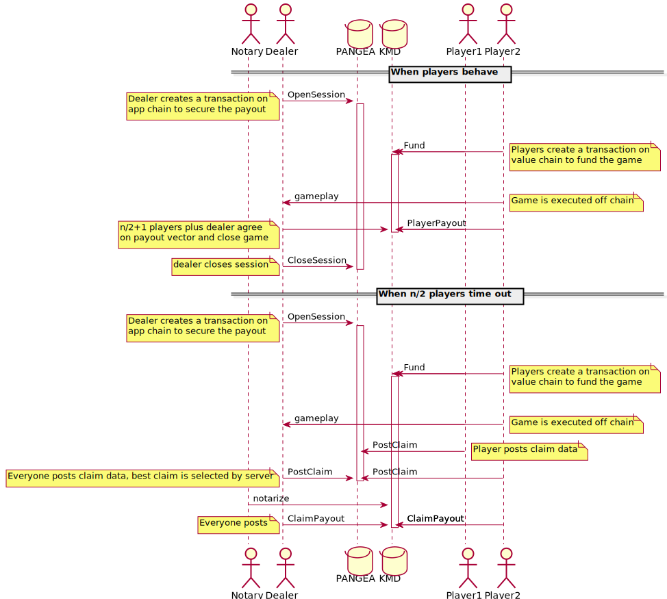

# Protocol for smart contracts using Crypto-Conditions

To facilitate participation in off-chain smart contracts on the [Komodo Platform](https://komodoplatform.com/en), providing a mechanism for dispute resolution.

* [Introduction](#introduction)
   * [Properties](#properties)
* [Smart Contract Workflow](#smart-contract-workflow)
   * [Blockchain Poker](#blockchain-poker)
      * [Game Opening](#game-opening)
      * [Game Closing - Common case](#game-closing---common-case)
      * [Game Closing - Timeout / Dispute](#game-closing---timeout--dispute)
* [Transactions](#transactions)
   * [Transaction: Fund](#transaction-stake)
   * [Transaction: Session](#transaction-startgame)
   * [Transaction: PlayerPayout](#transaction-playerpayout)
   * [Transaction: PostClaim](#transaction-claimdata)
   * [Transaction: ResolveClaim](#transaction-resolveclaim)
   * [Transaction: ClaimPayout](#transaction-payoutclaim)
   * [Notary proof format using MOM](#notary-proof-format-using-mom)
   * [Chain func: LockTime](#chain-func-locktime)
   * [Chain func: VerifyPoker](#chain-func-verifypoker)
   * [Chain func: ImportPayout](#chain-func-importpayout)

## Introduction

This section will introduce the relevant parts of the protocol, and the properties we want them to have.

There are two blockchains, a blockchain providing a value token (**KMD**) and a blockchain providing an evaluation function (**PANGEA**). KMD and PANGEA may be used to refer to the ledger or the currency unit on the ledger, as is the case with Bitcoin.

There are two or more **Players**, who own some KMD.

There is a **Dealer**, who owns some PANGEA.

The Players and the Dealer can be seen, more generally, as parties to a contract, who have different roles and interests.

### Properties

These are the properties that we want the solution to provide.

* Players only need to hold a single value token i.e. units of KMD.
* Only the Dealer needs to hold PANGEA. They may obtain this token via [atomic swap exchange](https://komodoplatform.com/en/barterdex).
* No new domain specific evaluation functions in value chain KMD (but we may introduce general purpose functions).
* Minimal data overhead in value chain KMD.
* On-chain dispute resolution protocol for domain specific evaluation.

## Smart Contract Workflow

In an ideal world, in order to facilitate off chain smart contracts we could simply have the players fund an escrow transaction, do their off-chain processing, and submit an escrow release with an updated payout vector.

However, in reality, for certain kinds of problems, we require a dispute resolution protocol. This is because players may timeout, or a player may refuse to sign a payout transaction if they lose a bet.

In practice, there isn't alot of distinction between a timeout and a dispute; a player that refuses to sign a payout and a player that has timed out are indistinguishable from a cryptographic perspective. In either case, if an n/2+1 majority remains, they get to decide what happens.

If, after a single player has timed out, there does not remain an n/2+1 majority, then we have to fall back to the dispute resolution protocol.

The below table illustrates:

| # players | # sigs for payout | # timeouts for dispute |
|-----------|-------------------|------------------------|
| 2         | 2                 | 1                      |
| 3         | 2                 | 2                      |
| 4         | 3                 | 2                      |

### Blockchain Poker



Let there be actors: **Dealer**, **Player1**, **Player2**. Each has a public and a private key. Addionally, **Notary** is an oracle backed by a collection of network node operators.

#### Game Opening

1. Player1 and Player2 locate and connect to Dealer. That is outside the scope of this document.
1. The game has a **Params**, for example, the game ID and the dealer's commission.
1. Player1 and Player2 jointly sign a transaction (**Fund**) on the KMD blockchain. The transaction includes a data output with **Params**. The transaction is reviewed by the dealer, and broadcast to the KMD network.
1. Dealer creates a transaction (**Session**) on the PANGEA network. The transaction has dedicated dispute outputs for each of the players, and the dealer. It also has an output with a timelock, which triggers a review. The transaction is reviewed by the players and broadcast to the PANGEA network.
1. Game is played privately between players using **PVM** (Poker Virtual Machine).

#### Game Closing - Common case

The quorum required to close the game consists of **n/2+1 players + dealer**. In a 2 player scenario that means both players plus the dealer.

1. Player1, Player2, and Dealer all agree to sign transaction **PlayerPayout**, which spends the **Fund** according to the payout vector output of the **PVM**. The transaction is broadcast to the KMD network and no further action is required.

#### Game Closing - Timeout / Dispute

In a 2 player scenario, any single actor may dispute the game and the network will evaluate the posted game states.

1. A single actor, lets say Player1 decides it is neccesary to invoke an external judiciary entity, in this case the application blockchain. They create a transaction **GameState**, spending their dedicated output of **Session**. In a data output of this transaction, they attach the compressed output of the PVM, with signatures from all players.
1. Player2 and Dealer notice that Player1 has posted evidence. If they wish, they can also post **GameState** transactions. The evidence is simply a game state, which is the output of the **PVM**, signed by all players.
1. Any player may create a transaction **TriggerReview**, which starts a countdown of a number of blocks, after which the game states will be evaluated. Participants have until this timeout to post their game states.
1. When **TriggerReview** is accepted into the app chain, the game states will be evaluated on-chain using a call to **PVM**. **Notary** will take the payout vector is taken from the longest valid gamestate, and use it to compile transaction **NotaryPayout**. This transaction will then be broadcast to the KMD chain.


## Transactions

If you havn't already, this might be a good time to refer to the [transaction basics](./basics.md) document.

Transactions in this section are using a format suitable for passing to Hoek to sign and encode.

```haskell
import Data.Aeson.Encode.Pretty
import Data.Bits hiding (Bits)
import qualified Data.ByteString.Lazy.Char8 as C8L
import Data.Serialize
import Network.Komodo.CryptoConditions
import Network.Komodo.Transaction
import Network.Haskoin.Crypto as H
import Network.Haskoin.Block.Merkle as H
import Network.Haskoin.Crypto.Keys as H
import Network.Haskoin.Network as H
import Network.Haskoin.Transaction as H
import Network.Haskoin.Util as H
import Network.Komodo.Prelude
dealer="025af7eed280ca8d1ebb294e9388378a2abf5455072c17bdf22506b6aa18dc8a24" :: H.PubKey
player1="03c8a965089173d746144cd667c8cedf985460ecc155811bd729e461f0079222f7"
player2="03d6de78061ca1695ba068d15ecf4a5431de9dccce7b45a73bb996e7e596acdba7"
ecCond pk = Secp256k1 (pubKeyPoint pk) Nothing
addressInput :: H.PubKey -> InputScript
addressInput pk = AddressInput $ pubKeyAddr pk
privKeys = [ "UrsT8pXPH1WvfTkkRzP2JsLTB6ebqhH3n6p31UcXpgyoESB9wvPp" -- dealer
           , "Up3VgThhFXFXG7QN5ykym2hkiBrfB76GNhehyUXNG7AJMdLoVPU7" -- player1
           , "UpyycopsYkknBsPd5Y2BLzKrTYVnhKoFL59H49JWn6TqXmJKxER4" -- player2
           ]
signEncode tx = 
  let Right r = runExcept $ signTxSecp256k1 privKeys tx >>= signTxBitcoin privKeys >>= encodeTx
   in r
main =
  let write path tx = C8L.writeFile path $ encodePretty tx
   in do write "specs/vectors/txFund.json" stakeTx
         write "specs/vectors/txSession.json" startGameTx
         write "specs/vectors/txPlayerPayout.json" playerPayoutTx
         write "specs/vectors/txPostClaim.json" claimDataTx
         write "specs/vectors/txResolveClaim.json" resolveClaimTx
         write "specs/vectors/txPayoutClaim.json" payoutClaimTx
```

### Transaction: Fund

JSON: [txFund.json](./vectors/txFund.json)

The **Fund** transaction is made on the KMD chain, and uses inputs from each player, and creates a single CryptoCondition output. The output may either be spent by a quorum of the participants (n/2+1 players + dealer), or by a subset of notaries.

```haskell
-- payout is either ImportPayout or quorum
quorumCond = Threshold 2 [ ecCond dealer
                         , Threshold 2 [ ecCond player1, ecCond player2 ] ]
payoutCond = Threshold 1 [ quorumCond
                         , Eval "ImportPayout" (encode startGameTxid) ]

stakeTx =
  let inputs =
        -- players fund game
        [ TxInput (OutPoint "ec851f0d887638016f5d6818a1ace0038abccdb502d2b0d661c97d853d089a65" 0) 
                  (addressInput player1)
        , TxInput (OutPoint "b66de6fc17844c0151c2cfb146435e466290f5aacefb5b3ac1f437a0c7b046d9" 0)
                  (addressInput player2)
        ]
      stakeAmount = 1000
      outputs = [ TxOutput stakeAmount $ CCOutput payoutCond ]
   in KTx inputs outputs

stakeTxid = txHash $ signEncode stakeTx
```


### Transaction: Session

JSON: [txSession.json](./vectors/txSession.json)

The **Session** transaction is made on the PANGEA chain, and contains the ID of the **Fund** transaction as a data output. The dealer is expected to hold the PANGEA units neccesary to make this transaction. The dealer also provides outputs that are sufficient for the players to post gamestates in the event of a dispute. An exec output is provided that will trigger an on-chain evaluation a subsequent payout; it includes a delay of a number of blocks before it can be triggered.

Note: Currently, this transaction may or may not be used; in the case that it is not used, it would be good to provide the dealer with a way to recollect the outputs, even though they maybe just amount to dust.

```haskell
addrOutput :: Amount -> H.PubKey -> TxOutput
addrOutput n pk = TxOutput n $ AddressOutput $ pubKeyAddr pk
dataFee = 4
evalFee = 10
delayBlocks = "some number of blocks"
-- lock time a certain number of blocks so players can post evidence,
-- and require a sig from any participant to initiate Exec
evalClaimCond = Threshold 3 [ Eval "LockTime" delayBlocks
                            , Eval "VerifyPoker" ""
                            , Threshold 1 [ ecCond dealer
                                          , ecCond player1
                                          , ecCond player2 ] ]
startGameTx =
  KTx
    -- Dealer provides units of PANGEA
    [ TxInput (OutPoint "c44de6fc17844c0151c2cfb146435e466290f5aacefb5b3ac1f437a0c7b046d9" 0)
              (addressInput dealer)
    ]
    -- Output for each player to post game state binary
    [ addrOutput dataFee dealer
    , addrOutput dataFee player1
    , addrOutput dataFee player2
    , TxOutput evalFee $ CCOutput evalClaimCond
    ]


startGameTxEncoded :: H.Tx
Right startGameTxEncoded =
  runExcept $ signTxSecp256k1 privKeys startGameTx >>= signTxBitcoin privKeys >>= encodeTx
startGameTxid = txHash startGameTxEncoded
```

### Transaction: PlayerPayout

JSON: [txPlayerPayout.json](./vectors/txPlayerPayout.json)

The **PlayerPayout** transaction is made on the KMD chain. It is independent of the **Session** transaction. It distributes the stake according to a payout vector that is agreed upon by a majority of the players + the dealer.

```haskell
payouts = [addrOutput 50 dealer, addrOutput 950 player1]
playerPayoutTx = KTx
  -- Spending the stake
  [ TxInput (OutPoint stakeTxid 0) $ ConditionInput payoutCond ]
  -- Payout each participant
  payouts
```

### Transaction: PostClaim

JSON: [txPostClaim.json](./vectors/txPostClaim.json)

The **PostClaim** transaction is made on the PANGEA chain. It registers a game state for evaluation, in the case that **PlayerPayout** is not possible for some reason. Each player has the opportunity to perform a **PostClaim** by spending an output of the **Session** transaction.

```haskell
claimDataTx = KTx
  -- Output index depends on who is making the claim
  [ TxInput (OutPoint startGameTxid 1) (addressInput player1) ]
  -- There is no output amount, the whole input is fees
  [ TxOutput 0 $ CarrierOutput "game state for evaluation by PVM" ]
```

### Transaction: ResolveClaim

JSON: [txResolveClaim.json](./vectors/txResolveClaim.json)

The **ResolveClaim** transaction posts a resolution of the claim. The resulution will be evaluated and the transaction will only be accepted if the claim is correct.

```haskell
resolveClaimTx =
  let claimIdx = 3 -- zero indexed n participants plus one
      payoutsBin = encode $ toHaskoinOutput <$> payouts
   in KTx
      [ TxInput (OutPoint startGameTxid claimIdx) (ConditionInput evalClaimCond) ]
      [ TxOutput 0 (CarrierOutput payoutsBin) ]
```


### Transaction: PayoutClaim

JSON: [txPayoutClaim.json](./vectors/txPayoutClaim.json)

The **PayoutClaim** transaction executes a payout vector with reference to a **ResolveClaim** transaction. Only one signature is required to execute it, but it requires the complete payload of the **ResolveClaim** transaction, plus notary proof of that transaction. Additionally, the **ResolveClaim** transaction must have the correct format:

1. The first output must contain the **ResolveClaim** raw transaction.
1. The second output must contain cryptographic proof of notarisation in the PANGEA chain of that transaction.
1. The last outputs must be a byte for byte copy of the OP\_RETURN data in **ResolveClaim**.

```haskell
payoutClaimTx =
  let (KTx _ [TxOutput _ (CarrierOutput payoutsBs)]) = resolveClaimTx
      txOutResolveClaim = TxOutput 0 $ CarrierOutput $ encode $ signEncode resolveClaimTx
      txOutNotaryProof = TxOutput 0 $ CarrierOutput $ encode importProofExample
   in KTx
      [ TxInput (OutPoint stakeTxid 0) (ConditionInput payoutCond) ]
      ([ txOutResolveClaim , txOutNotaryProof ] ++ payouts)

```

### Notary proof format using MOM

The notary proof is neccesary since we are importing a paying vector from another chain. So the notaries are used as an oracle to say that the referenced transaction was accepted by the app-chain.

App chains of this type will intermittently post notarisations to the value chain (KMD). These notarisations indicate that the block being notarised has some degree of finality, which we are going to accept. Given a transaction ID, the SPV protocol can be used to verify that it exists in a block. However, not every block is notarised, because app chains may have short block times, so they may only notarise every 100 blocks or so. In this case, in order to support payment verification across chains, the notarisation will include a **MOM** ("Merkle of Merkles").

The MOM is simply a binary [Merkle Tree](https://en.wikipedia.org/wiki/Merkle_tree) where the leaf nodes are all the transaction merkle roots since the last notarisation, and up to and including the block currently being notarised.

[SPV](https://bitcoin.org/en/glossary/simplified-payment-verification) protocol provides a merkle branch to verify that a transaction ID is contained in a block:

`txid -> merkle branch -> block merkle root`

So in this case we concatenate the SPV merkle branch and the MOM merkle branch so it reaches all the way to the MOM:

`txid -> merkle branch -> MOM`

We're not really worried about if or when the block merkle root is encountered. Just that we can use the merkle branch to go from the txid to to the MOM. The merkle branch is a list of node hashes, plus a varint. The bits of the varint correspond to the hashes in the list, and specify whether the node is left or right.


```haskell

type Bits = Word64

data TxImportProof = TxImportProof
    { notarisationTxid :: TxHash
    , merkleBranch :: [H.Hash256]
    , merklePositions :: Bits
    }

instance Serialize TxImportProof where
    put (TxImportProof ntxid nodes pos) = do
        put ntxid
        put $ H.VarInt $ fromIntegral $ length nodes
        mapM put nodes
        put $ H.VarInt pos
    get =
        let getNodes = do
            VarInt n <- get
            replicateM (fromIntegral n) get
         in TxImportProof <$> get <*> getNodes <*> get


importProofExample = TxImportProof
    "0000000100010001010100000001000000000000000001010000010000000001" -- TxId of notarisation
    (map H.hash256 ["", "0"::ByteString])                              -- Two merkle nodes
    2                                                                  -- left, right

execMerkleBranch :: [H.Hash256] -> Bits -> H.Hash256 -> H.Hash256
execMerkleBranch [] _ h = h
execMerkleBranch (n:xs) bits h = execMerkleBranch xs (shiftR bits 1) $
  (if testBit bits 0 then id else flip) H.hash2 n h


verifyMerkleBranch :: [H.Hash256] -> Bits -> TxHash -> MOM -> Bool
verifyMerkleBranch nodes bits txid mom = execMerkleBranch nodes bits (getTxHash txid) == mom
```

### Chain func: LockTime

LockTime is a Crypto-Conditions eval method that specifies an interval in blocks before the condition may be fulfilled, relative to the block height of the condition.

Parameters:

* `nBlocks`: Number of blocks encoded as a VarInt, via preimage.

Verifications:

* That the block height of the transaction that contains the LockTime condiiton, plus `nBlocks`, is less than the current block height being mined.

### Chain func: VerifyPoker

VerifyPoker is a Crypto-Conditions eval method that evaluates a data output against a set of application states. It is fulfilled by **ResolveClaim**.

Parameters:

* Poker GameHeader, including: game ID, public keys of participants.
* Winning output binary, via OP\_RETURN at output 0.
* List of posted game states, inside OP\_RETURN 0 of spending transactions for each of the parent transaction (**Session**) outputs starting at output 1.

Verifications:

1. Valid states are ones that conform to the provided GameHeader 
1. For each of the posted game states, that the longest valid state produces the exact same binary attached in OP\_RETURN output 0. This is equivalent to the "longest chain wins" rule.

### Chain func: ImportPayout

ImportPayout is a Crypto-Conditons eval method that is used to execute a payout vector from another chain. It is fulfilled by the **PayoutClaim** transaction on KMD chain.

Parameters:

* ID of **Session** transaction on PANGEA, via preimage.
* Complete body of **ResolveClaim** transaction on PANGEA, via OP\_RETURN at output 0.
* **TxImportProof** notary proof, via OP\_RETURN at output 1.

Verifications:

1. That the output 0 of the Session transaction has been spent, by the attached ResolveClaim. This indicates that the attached payout vectors were verified by the app-chain eval function (VerifyPoker).
1. That the notarisation ID included in the TxImportProof points to a transaction signed by notaries.
1. That the TxImportProof is valid given the txid of the ResolveClaim transaction and the MOM from the notarisation.
1. That the OP\_RETURN output of the attached ResolveClaim transaction is exactly equal to the outputs in PayoutClaim, not including the attachments (drop the attachments from the list of outputs of PayoutClaim).


```haskell

type MOM = H.Hash256
getMOM :: TxHash -> IO MOM
getMOM txid = do
  tx <- dbGetTx txid
  assertNotaryTx tx
  getFirstDataOutput tx
  where
    dbGetTx = undefined
    assertNotaryTx = undefined
    getFirstDataOutput = undefined

--evalImportPayout :: Tx -> TxImportProof -> IO Bool
--evalImportPayout tx (notaryTxid, mb) = do
--  mom <- getMOM notartTxid
--  pure $ verifyMerkleBranch

```
